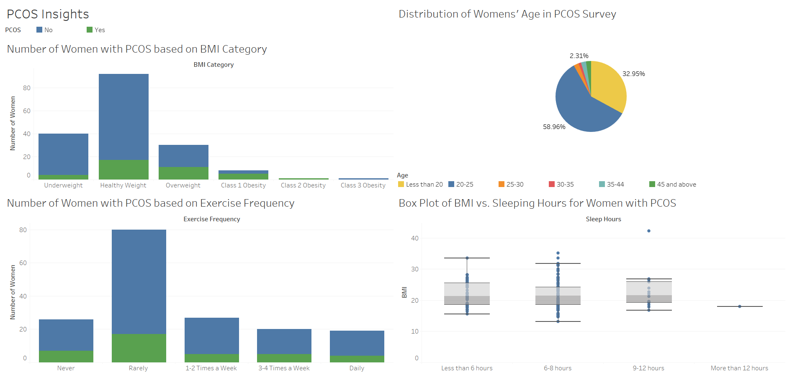

# 1. Problem Statement

The goal of this analysis is to use the Polycystic Ovary Syndrome (PCOS) dataset from Kaggle (<https://www.kaggle.com/datasets/hasaanrana/diet-exercise-and-pcos-insights>) to determine if there are any factors that could be linked to having the disease.

For more information about PCOS, here is a link to the Mayo Clinic (<https://www.mayoclinic.org/diseases-conditions/pcos/symptoms-causes/syc-20353439>).

# 2. Data Loading and Exploration

```{r message=FALSE, warning=FALSE}
library('dplyr')
library('ggplot2')
library('tidyr')
library('rmarkdown')
```

```{r}
pcos_data_raw <- read.csv('pcos_data.csv')
```

```{r}
dim(pcos_data_raw)
```

The dataset contains 173 rows and 36 columns.

```{r include=FALSE}
head(pcos_data_raw)
```

```{r}
colnames(pcos_data_raw)
```

```{r include=FALSE}
summary(pcos_data_raw)
```

```{r}
count(pcos_data_raw, PCOS, sort = TRUE)
```

The dataset contains 134 women without PCOS, 38 with PCOS, and one entry with both values.

# 3. Data Cleaning and Preparation

## 3.1 Dealing with Missing and Duplicated Values

```{r}
sum(is.na(pcos_data_raw))
```

The dataset does not contain any missing values.

```{r}
sum(duplicated(pcos_data_raw))
```

The dataset does not contain any duplicated rows.

## 3.2 Adding and Modifying Columns

```{r}
summary(pcos_data_raw$Height_ft)
```

The column above is called "Height_ft", but the values range from 124 to 182. That range is not possible for a human. According to the dataset's author, this column is actually in cm. The column name will be changed to reflect that.

```{r}
pcos_data_clean <- pcos_data_raw
```

```{r}
pcos_data_clean <- rename(pcos_data_clean, Height_cm = Height_ft)
```

```{r include=FALSE}
head(pcos_data_clean)
```

Since this study will be used within the USA, new columns will be added to convert the kg and cm columns to lbs and in respectively.

```{r}
pcos_data_clean <- mutate(pcos_data_clean, Height_in = Height_cm / 2.54, Weight_lb = Weight_kg * 2.204)
# 2.54 cm in an inch
# 2.204 kg in a lb
```

```{r include=FALSE}
head(select(pcos_data_clean, Weight_kg, Weight_lb, Height_cm, Height_in))
```

The Weight_kg and Height_cm columns will now be dropped from the dataset.

```{r}
pcos_data_clean <- select(pcos_data_clean, -c(Weight_kg, Height_cm))
```

```{r include=FALSE}
head(pcos_data_clean)
```

A common measure for if someone is at a healthy weight for their height is body mass index (BMI). The formula for this using English units is:

$$
BMI = 703 * \frac{weight (lb)}{height^2 (in)}
$$

This column will be added to the dataset.

```{r}
pcos_data_clean <- mutate(pcos_data_clean, BMI = 703 * (Weight_lb / (Height_in ^ 2)))
```

```{r include=FALSE}
head(select(pcos_data_clean, Weight_lb, Height_in, BMI))
```

Since the new columns we added to the end of the dataframe, the will be rearranged to the second through fourth columns.

```{r}
pcos_data_clean <- select(pcos_data_clean, c(1, 35, 36, 37, 2:34))
```

```{r include=FALSE}
head(pcos_data_clean)
```

The Marital_Status column will be checked to make sure the selections are valid.

```{r}
count(pcos_data_clean, Marital_Status)
```

According to the CDC (<https://www.cdc.gov/bmi/adult-calculator/bmi-categories.html>), there are ranges within BMI that can be used to categorize a person's health as follows:

-   Less than 18.5: Underweight
-   18.5 - 24.9: Healthy Weight
-   25 - 29.9: Overweight
-   30 - 34.5: Class 1 Obesity
-   35 - 39.9: Class 2 Obesity
-   40+: Class 3 Obesity

A new column with this category will be added to make it easier to compare people based on BMI.

```{r}
BMI_groups <- cut(pcos_data_clean$BMI, breaks = c(0, 18.4, 24.9, 29.9, 34.5, 39.9, 100), 
                  labels = c("Underweight", 
                             "Healthy Weight", 
                             "Overweight", 
                             "Class 1 Obesity", 
                             "Class 2 Obesity",
                             "Class 3 Obesity"))
```

```{r}
print(table(BMI_groups))
```

```{r}
count(pcos_data_clean, BMI < 18.4)
```

```{r}
pcos_data_clean$BMI_Cat <- BMI_groups
```

```{r include=FALSE}
head(select(pcos_data_clean, BMI_Cat, BMI))
```

```{r}
pcos_data_clean <- select(pcos_data_clean, 1:4, 38, 5:37)
```

```{r include=FALSE}
head(pcos_data_clean)
```

```{r}
write.csv(pcos_data_clean,"pcos_data_clean.csv", row.names = FALSE)
```

# 4. Data Visualization in Tableau

Here is a dashboard of some of the insights using Tableau.



# 5. Analysis

## 5.1 General Questions

1.  How many women with PCOS have a BMI under 25?

```{r}
count(pcos_data_clean, PCOS == 'Yes'& BMI < 25)
```

2.  What is the mean BMI women with and without PCOS?

```{r}
pcos_data_clean %>% group_by(PCOS) %>% summarise(mean(BMI))
```

3.  How many women with PCOS also have a family history of PCOS?

```{r}
count(pcos_data_clean, PCOS == 'Yes'& Family_History_PCOS == "Yes")
```

4.  What is the distribution of BMI of women with PCOS?

```{r}
filter_data <- filter(pcos_data_clean, PCOS == 'Yes') %>% select(BMI)

ggplot(filter_data, aes(x=BMI)) + 
  geom_histogram(binwidth = 0.5, fill = 'lightblue', color = 'black') + 
  ggtitle("Histogram of BMI of Women with PCOS") + ylab('Number of Women')
```

5.  How many women with PCOS fall under each category of exercise frequency (in a bar graph)?

```{r}
filter_data <- filter(pcos_data_clean, PCOS == 'Yes') %>% 
  select(Exercise_Frequency) %>%  
  mutate(filter_data, Exercise_Frequency = factor(Exercise_Frequency, levels=c("Never", "Rarely", "1-2 Times a Week", "3-4 Times a Week", "Daily"))) 

ggplot(filter_data, aes(x=Exercise_Frequency)) + 
  geom_bar(fill = 'lightblue', color = 'black') + 
  ggtitle("Bar Graph of Exercise Frequency of Women with PCOS") + 
  ylab('Number of Women') +
  xlab('Exercise Frequency')
```

## 5.2 Inferential Statistics


**t-Test for Mean BMI of PCOS Population**

To test if the BMI women with PCOS in the population is higher than the healthy range, a t-test will be used to find the population BMI confidence interval.

Here is the set up for the t-test with assumptions:

Confidence level: 95% (p value = 0.05)

-   H0: The population mean BMI for women with PCOS includes 25 (upper end of healthy)
-   H1: The population mean BMI for women with PCOS excludes 25 (upper end of healthy)

Assumptions:

1.  Can the observations be independent?

    The data is assumed to come from a random survey of women with and without PCOS.

2.  Is the data normally distributed?

    While BMI is not normally distributed within the sample, given a large enough sample, the distribution is assumed to approach normal due to the central limit theorem.

```{r}
alpha <- 0.95

pcos_bmi_data <- filter(pcos_data_clean, PCOS == 'Yes') %>% select(BMI)

```

```{r}
t.test(pcos_bmi_data, conf.level = alpha)
```

The test shows with a 95% confidence level that the mean BMI of the population of women with PCOS is between 22.9 and 26.0. Since that interval contains 25, the test fails to reject the null hypothesis.


**Two Sample t-Test for Mean BMI of PCOS vs. No PCOS**

```{r}
pcos_data_clean %>% group_by(PCOS) %>% summarise(mean(BMI))
```

The mean BMI for women with PCOS is greater than the mean BMI for women without PCOS within the sample data. A two sample t-test will be used to determine if the mean BMI for women with PCOS is greater than the BMI of women without PCOS in the population.

Here is the set up for the two sample t-test:

Confidence level: 95% (p value = 0.05)

-   H0: The population mean BMI for women with PCOS is less than or equal to the mean BMI for women without PCOS
-   H1: The population mean BMI for women with PCOS is greater than the mean BMI for women without PCOS

```{r}
no_pcos_bmi_data <- filter(pcos_data_clean, PCOS == 'No') %>% select(BMI)
```

```{r}
t.test(pcos_bmi_data, no_pcos_bmi_data, alternative = "greater", var.equal = FALSE)
```
Assuming the population mean BMI for women with PCOS is less than or equal to the mean BMI for women without PCOS, there is a 0.00205 probability that the data observed is due to sampling variably. Since 0.00205 is less than the p value of 0.05 for a 95% confidence level, the null hypothesis is rejected and conclude that the population mean BMI for women with PCOS is greater than the mean BMI for women without PCOS.


**Chi Square Test for Effect of Family History of PCOS**

```{r}
pcos_data_yes_no <- filter(pcos_data_clean, (PCOS == "Yes" | PCOS == "No") & (Family_History_PCOS == "Yes" | Family_History_PCOS == "No"))

pcos_fam_hist_table <- table(pcos_data_yes_no$PCOS, pcos_data_yes_no$Family_History_PCOS)

names(dimnames(pcos_fam_hist_table)) <- c("PCOS", "Family History of PCOS")
pcos_fam_hist_table
```

According to the table above, 10 of the women with PCOS have a family history of PCOS.  To test how significant family history is to having PCOS, a chi square test of independence will be used.  

Here is the set up for the chi square test:

Confidence level: 95% (p value = 0.05)

-   H0: Having PCOS is independent from having a family history of PCOS
-   H1: Having PCOS is dependent on having a family history of PCOS


```{r}
chisq <- chisq.test(pcos_fam_hist_table)
chisq
```
```{r}
chisq$residuals
```
Assuming that having PCOS is independent from having a family history of PCOS, there is a 0.05654 probability that the observed data is due to sampling variability.  Because 0.05654 is greater than the p value of 0.05 for a 95% confidence level, the test fails to reject the null hypothesis and conclude that having PCOS is independent from having a family history of PCOS.


# 6. Conclusion

The goal of this analysis was to uncover insights about the variables related to having PCOS.  Here are the results of the factors studied given a 95% confidence level:

- The mean BMI for a women with PCOS does include the upper end healthy BMI of 25.
- The mean BMI for a women with PCOS is greater than the mean BMI of women without PCOS.
- Family history of PCOS is independent from having PCOS.

Additionally, visualizing the data has shown that the majority of women with PCOS rarely exercise, and have a healthy BMI.  

While there are several other factors to analyze related to this dataset, it shows how important having a healthy weight is to PCOS.  That conclusion is supported by what we already know about PCOS according to Medical News Today that between 38 - 88% of women with PCOS are overweight or obese (https://www.medicalnewstoday.com/articles/pcos-and-obesity#the-connection).
